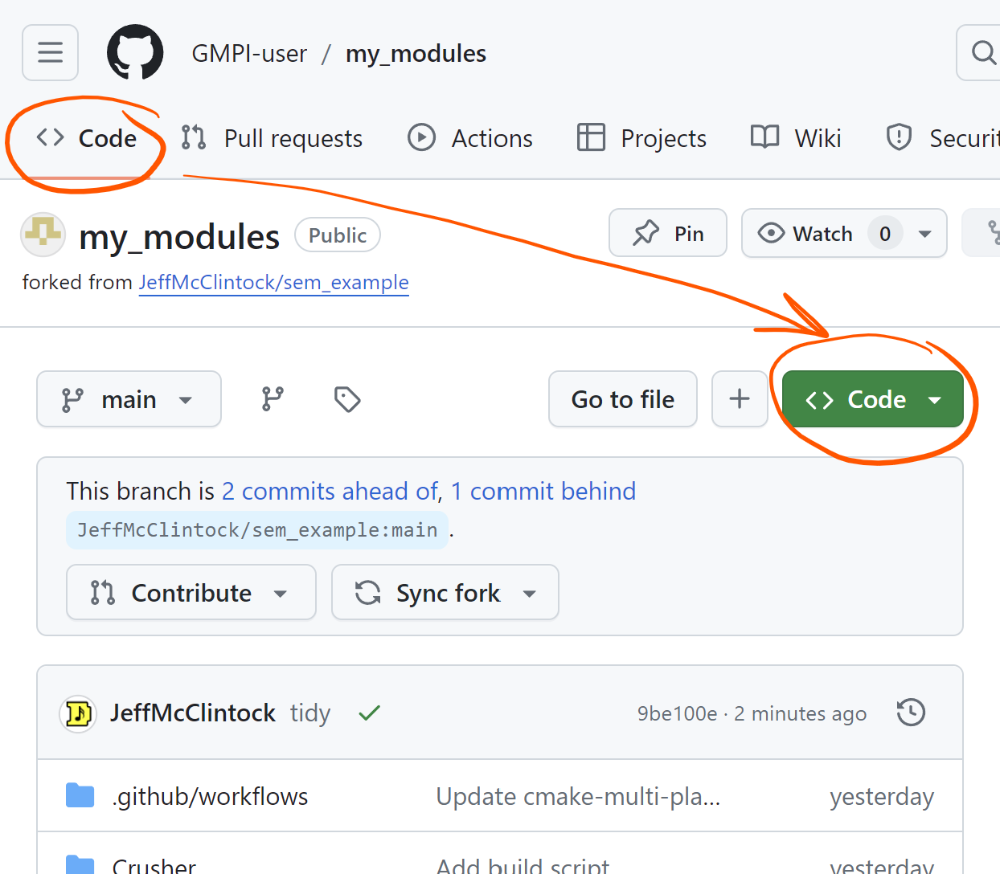
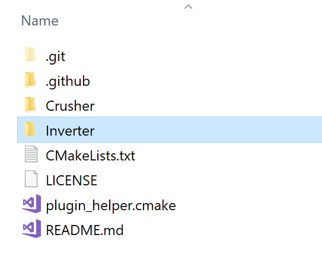
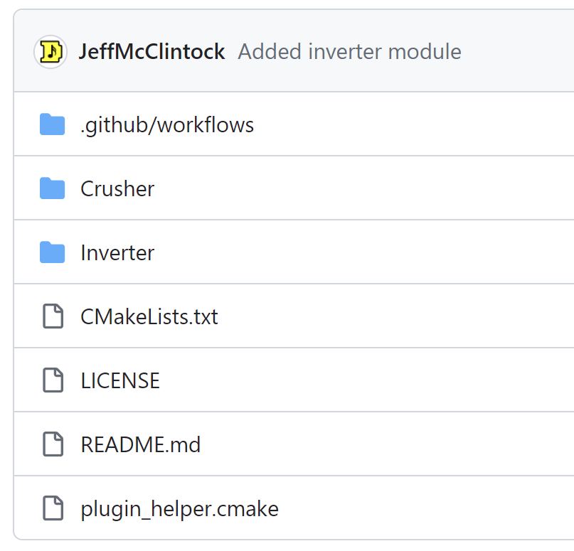
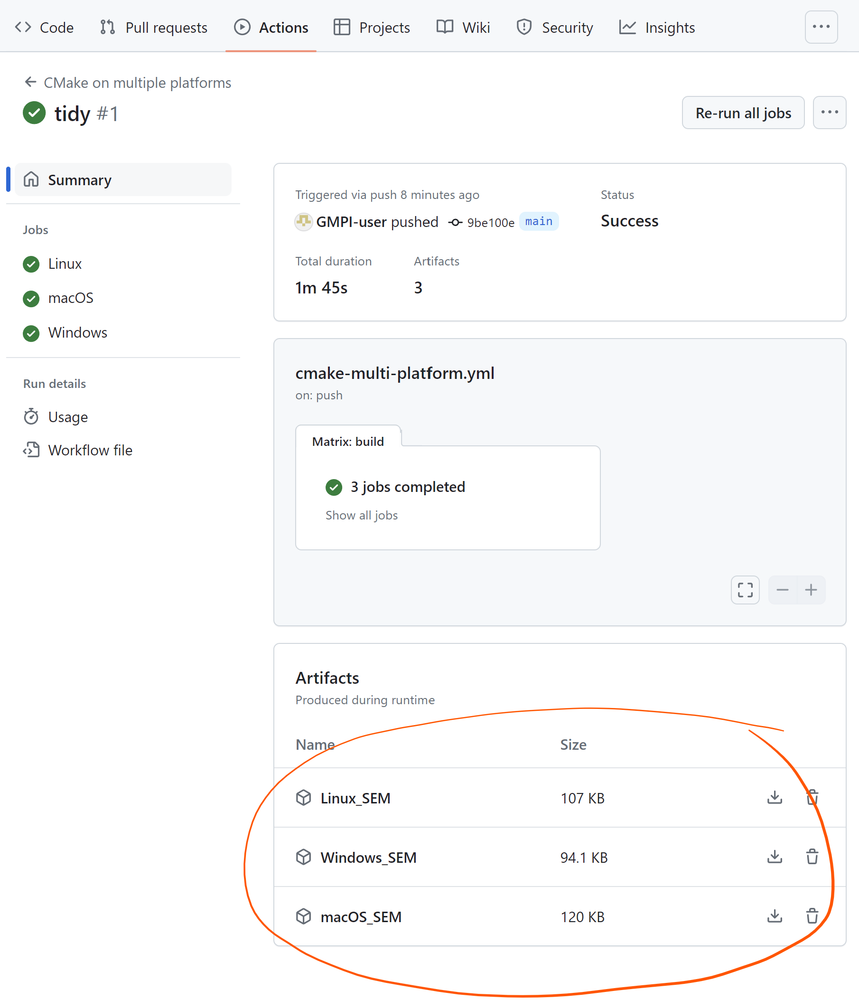

#maxbreges's repository for storing code of SynthEdit modules

FORKED FROM https://github.com/JeffMcClintock/sem_example
# sem_example
Example of building a SynthEdit module for Windows and macOS on GitHub

# Steps

## Make a copy of the example module from Github
1. Create a GitHub account if you don't already have one. https://github.com/

2. Fork this repository ( https://github.com/JeffMcClintock/sem_example ) to your own GitHub account by clicking the "Fork" button in the upper right corner of this page.
When prompted for 'Repository name:' type: my_modules

3. Enable automatic building of your modules, click the "Actions" tab. If this is the first time, you will need to enable the 'workflow' (the process of building your module). Click "I understand my workflows, go ahead and enable them."

4. To clone (copy) your forked repository to your computer, back on the "Code" page click the green "Code" button and then "Open with GitHub Desktop"



GitHub desktop is an application that makes it easy download or upload your code to the GitHub website. If you don't already have it installed, you can download it here: https://desktop.github.com/

5. In the GitHub desktop application, if you haven't already 'clone' (download) the code from "my_modules" on GitHub. If asked "How are you planning to use this fork?" choose "for my own purposes"

6. Right-click the repo name ("my_modules"), you can choose "Show in Explorer" to see the code. You should see the folder with a few files and a 'Crusher' folder (this is an example module).

## Add your own module to the repository

7. Find a module that you have made or want to share. Copy the folder to the 'my_modules' folder. Here I copied my 'Inverter' module.


8. Copy the file CMakeLists.txt from the Crusher folder into your new folder. This file describes how to build your module.
Edit the file: On the 3rd line, change the project name from Crusher to e.g. Inverter (in my case).
on the 2nd to last line change the source code filenames to match your module. You can list several if you need to.

Before

```cmake
cmake_minimum_required(VERSION 3.19)

project(Crusher)

build_gmpi_plugin(
    PROJECT_NAME ${PROJECT_NAME}
    HAS_DSP
    SOURCE_FILES 
        Crusher.cpp
)
```

After

```cmake
cmake_minimum_required(VERSION 3.19)

project(Inverter)

build_gmpi_plugin(
    PROJECT_NAME ${PROJECT_NAME}
    HAS_DSP
    SOURCE_FILES 
        Inverter.cpp
)
```

9. Add you module to the list of module that need to be built. Back in the parent folder "my_modules" edit the CMakeLists.txt,
 look for the line `add_subdirectory(Crusher)` and add a new line with the name of your module folder. In my case I added `add_subdirectory(Inverter)`

````cmake
include(plugin_helper.cmake)

# here is where you list your modules
add_subdirectory(Crusher)
add_subdirectory(Inverter)
````

Save any files that you changed.

10. Let Github desktop know about your new files. In GitHub Desktop, you should see your new files listed in the "Changes" tab. Write a brief description of what you are doing in the "Summary" box, e.g. "Added Inverter module".  Click the "Commit to main" button to save your changes to your local copy of the repository.

11. Send your changes up to the Github website. Click the "Push origin" button in the upper right corner of the GitHub Desktop application.

12. Go to the GitHub website, find your 'my_modules' repository and check that your changes are there. You should see your new files listed in the repository.



13. Click the "Actions" tab to see the progress of the build. If all goes well, you should see a green checkmark next the 'workflow run' (build). If there is a problem, you can click on the "build" link to see the error messages.
You can click the run link next to the green tick to see more details and to download your SEMs (aka 'Artifacts')


